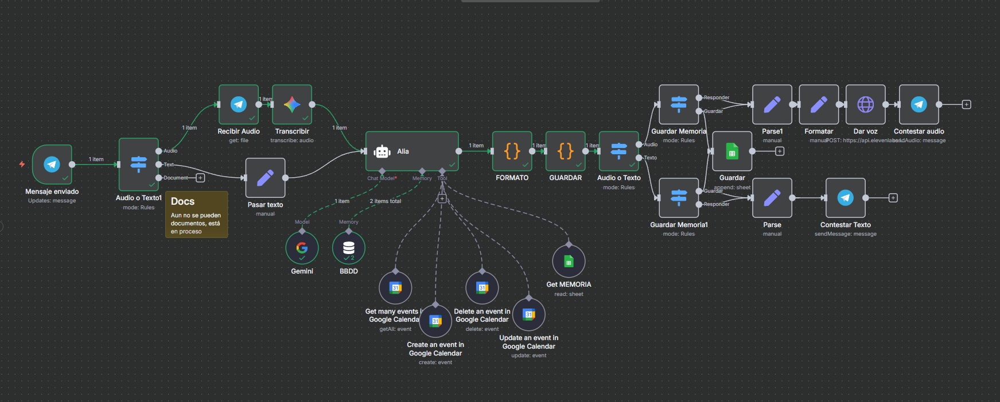

# Alia – Asistente IA con memoria en n8n

Alia es un asistente personal hecho en n8n que combina Google Gemini, Telegram, Google Sheets y ElevenLabs.  
Puede hablar contigo, recordar información importante y responder en texto o por voz.
(En proceso de crecimiento)

---

## Qué hace

- Guarda recuerdos en Google Sheets como memoria persistente para que pueda recordar cosas importantes\ny sea capaz de dar mejores respuestas (Solo cuando considera oportuno memoriza la informacion).  
- Capacidad de decidir si responde con voz por la api ElevenLabs o con texto, para respuestas mas adecuadas y comodas.  
- Consulta y gestiona eventos en Google Calendar.  
- Todo automatizado dentro de n8n.

  
  [Descargar audio](imgs/data.mpga.mp3)

---

## Cómo funciona

1. Le hablas por Telegram (texto o audio).  
2. Si envías audio, lo transcribe y analiza con Gemini.  
3. Consulta su memoria en Google Sheets para mantener el contexto del usuario.  
4. Genera una respuesta coherente usando la información guardada.  
5. Si aprende algo nuevo, lo guarda automáticamente en la hoja.
6. Decide si contestar mediante audio o texto.

   

---

## Cómo usarlo

1. Importa el flujo `Alia.json`.  
2. Conecta tus credenciales:
   - Google Sheets  
   - Google Calendar  
   - Gemini
   - Telegram Bot  
   - ElevenLabs  
3. Edita el prompt y aclarale tu informacion (Si tienes calendarios compartidos dales nombre)
4. Ejecuta el flujo y empieza a hablar con Alia.

   

---

## Memoria persistente (Google Sheets)

Dejaré el excel para descargar

   

---

## Autor
Creado por Albert Burgos  

